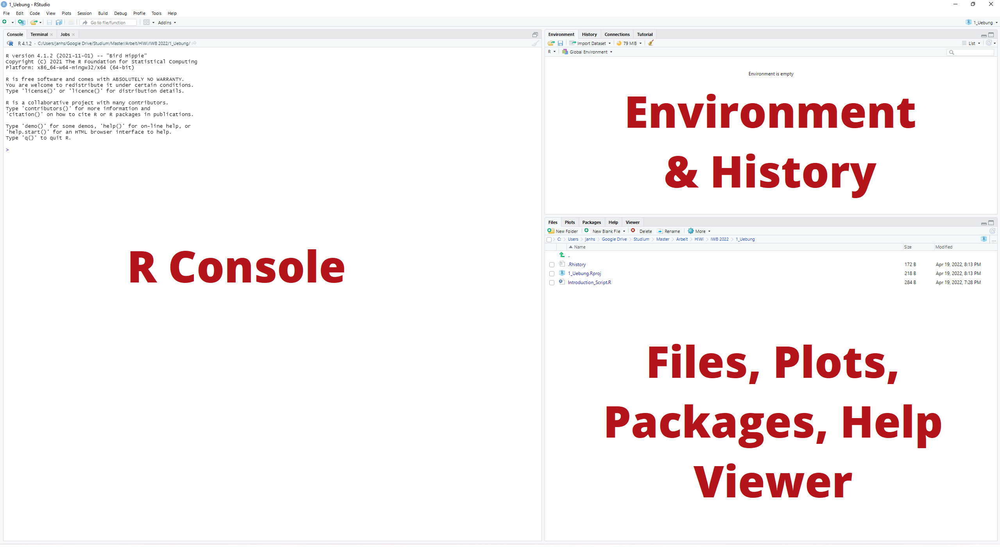

# Exercise Number 1: Introduction to R

## Christopher Diebel & Jan-Hendrik Schmidt - ISE Darmstadt

## Helpful Links

-   :house_with_garden:
    [Home](https://github.com/tud-ise/Wellbeing_SoSe2022/blob/main/README.md)
-   :open_book: [Information about R](https://www.r-project.org/)
-   :open_book: [`dplyr`
    documentation](https://dplyr.tidyverse.org/reference/index.html)
-   :open_book: Further Reading [R for Data
    Science](https://r4ds.had.co.nz/), [R für
    Einsteiger](http://aproxy.ulb.tu-darmstadt.de:2058/book/index.cfm?bok_id=1993358)
    or [Einführung in
    R](https://methodenlehre.github.io/einfuehrung-in-R/die-r-sprache.html)
    (This is what this first exercise is largely based on)

## Preparation

Please work through the [Prerequisites
section](https://github.com/tud-ise/Wellbeing_SoSe2022/blob/main/README.md#0-prerequisites)
to be prepared for the first exercise.

## What is R?

R is a free software environment for statistical analysis.

### Graphical User Interface

Your opened RStudio should look something like the following:



The RStudio GUI consists of several areas. In the console area, R code
can be entered, which is then interpreted (executed) by R. The `>`
character is the R prompt (prompt character). This means that you can
work with R interactively, using it as a calculator, for example:

``` r
2+3
```

    ## [1] 5

``` r
exp(1)
```

    ## [1] 2.718282

``` r
3/4
```

    ## [1] 0.75

In the upper right corner, besides the History, which lists all the
commands you have executed so far, we find the Environment section.
There you will find all the variables, data sets and functions that have
been defined.

## Operators

### Arithmetic Operators

| Command   | Meaning                                   | Example (if appropriate) |
|-----------|-------------------------------------------|--------------------------|
| \+        | Addition                                  |                          |
| \-        | Subtraction                               |                          |
| \*        | Multiplication                            |                          |
| /         | Division                                  |                          |
| ^ or \*\* | Exponentiation                            |                          |
| x %\*% y  | Matrix Multiplication                     | c(1,4) %\*% c(3,5) == 23 |
| %/%       | Whole Number Division                     | 6 %/% 4 == 1             |
| %%        | Modulo (Remainder of a Division; x mod y) | 6 %% 4 == 2              |

### Logic Operators

| Command   | Meaning            | Example (if appropriate)   |
|-----------|--------------------|----------------------------|
| ==        | Equal              |                            |
| !=        | Unequal            |                            |
| \<        | Smaller than       |                            |
| \>        | Greater than       |                            |
| \<=       | Smaller equal      |                            |
| \>=       | Greater equal      |                            |
| &         | Logical AND        | (x & y)                    |
| \|        | Logical OR         | (x \| y)                   |
| !         | Logical NOT        | !x                         |
| xor(x, y) | Exclusive OR       | Either in x or y, not both |
| isTRUE(x) | Tests if x is true |                            |

The following graphic shows the use of the logical operators by means of
Venn diagrams. `x` always refers to the left circle, `y` to the right.
The selected area is always shown in dark. Source: [R for Data
Science](https://r4ds.had.co.nz/)


### Exercise Block

## R Functions

In the following we will look at some of the standard R functions that
can be used and that make up the language in the first place. Each
function can be called in the documentation (even if it was inserted via
a library - more to that later). Just call the command `help(fct-name)`
(just type it into the console). There you get a first overview about
the function and its parameters.

``` r
help(seq)
```

    ## starting httpd help server ... done

### Numerical Functions

| Command              | Meaning              | Example (if appropriate)         |
|----------------------|----------------------|----------------------------------|
| abs(x)               | Absolute Value       |                                  |
| sqrt(x)              | Square root          |                                  |
| ceiling(x)           | Round Up             | ceiling(4.687) is 5              |
| floor(x)             | Round Off            | floor(4.687) is 4                |
| round(x, digits = n) | Rounding             | round(4.687, digits = 2) is 4.69 |
| log(x)               | Natural Logarithm    |                                  |
| log2(x)              | Logarithm to base 2  |                                  |
| log10(x)             | Logarithm to base 10 |                                  |
| exp(x)               | Exponential Function | e^x                              |

### Statistical Functions

| Command                | Meaning                                           |
|------------------------|---------------------------------------------------|
| mean(x, na.rm = FALSE) | Mean Value                                        |
| sd(x)                  | Standard Deviation                                |
| var(x)                 | Variance                                          |
| median(x)              | Median                                            |
| quantile(x, probs)     | Quantiles of X (probs: Vector with Probabilities) |
| sum(x)                 | Sum                                               |
| min(x)                 | Minimum Value (x_min)                             |
| max(x)                 | Maximum Value (x_max)                             |
| range(x)               | x_min and x_max                                   |
